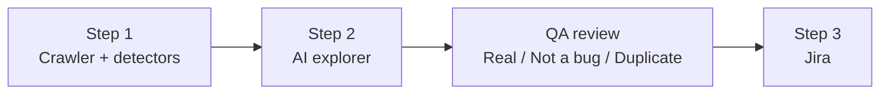
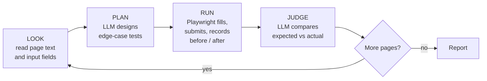

# 🎯 HuntPilot

**Autonomous bug hunting for web apps.** AI explores, QA decides, Jira gets verified bugs.

HuntPilot is an AI testing agent that works like a junior QA engineer. It signs into a web app, explores every page, designs its own edge-case tests, runs them in a real browser and reports what looks broken, with steps to reproduce, test data, expected vs actual results and screenshots.

Then a human QA engineer reviews every finding. Only the bugs marked as real are sent to Jira, linked to their user stories.

Built with **Playwright, LangGraph, Groq, FastAPI and React**.

> **Why the human checkpoint?** In testing, the AI found most of the hidden bugs, but it also reported correct behaviour as broken, drew conclusions from the wrong evidence and missed a bug without knowing it. HuntPilot is designed around that reality: AI does the exploring, people do the judging.

---

## Table of contents

- [How it works](#how-it-works)
- [Results](#results)
- [Features](#features)
- [Project structure](#project-structure)
- [Getting started](#getting-started)
- [Configuration](#configuration)
- [Usage](#usage)
- [Jira setup](#jira-setup)
- [Switching AI models](#switching-ai-models)
- [Safety and guardrails](#safety-and-guardrails)
- [Limitations](#limitations)
- [Roadmap](#roadmap)
- [Author](#author)

---

## How it works

HuntPilot runs in three steps:



### Step 1: Crawler and detectors (no AI)

A Playwright crawler signs in, visits every page, clicks safe buttons and listens for problems that don't need any judgement:

- JavaScript errors and crashes
- Failed network requests (4xx / 5xx)
- Broken links
- Accessibility violations (WCAG 2.1 AA, using axe-core)

This gives a **"before AI" baseline**, so the value the AI adds can be measured.

### Step 2: AI explorer (LangGraph + LLM)

For every page with a form, a LangGraph agent repeats a tester's routine:



- **Plan:** the LLM designs up to 6 tests per page: a valid case, boundary values, invalid input, past dates, double-clicks on anything that costs money, and so on. For each test it writes what a correct app *should* do.
- **Run:** Playwright executes each test from a freshly reloaded app, so tests can't affect each other, and records the page before and after plus a screenshot.
- **Judge:** the LLM compares expected and actual results and reports only clear defects, with evidence.

The **steps to reproduce and test data are generated from what the agent actually did in the browser**, not written by the LLM, so they are always accurate.

The agent only sees the running app. It never reads the application's source code.

### QA review

Every finding goes into a review sheet (`reports/qa_review.csv`) or the review screen in the UI. A QA engineer marks each one as **Real bug**, **Not a bug** or **Duplicate**, and adds notes.

### Step 3: Jira

Only findings marked **Real bug** are created in Jira, each with:

- Steps to reproduce, actual result, expected result, test data
- Environment details and the QA engineer's notes
- The screenshot as an attachment
- A link to the related user story

Running it again never creates duplicates.

---

## Results

HuntPilot was evaluated against **[QTB Bank](https://qtb-bank.vercel.app)**, a demo banking app built as a test target, with two users:

| User | Purpose |
|------|---------|
| `alex` | Clean app. Any finding here is a false alarm. |
| `sam` | Same app with **14 deliberately seeded bugs** (answer key kept private). |

Results from one evaluation run:

| Measure | Result |
|---|---|
| Seeded bugs found by Step 1 (no AI) | 5 of 14 |
| Seeded bugs found with the AI explorer added | **13 of 14** |
| AI findings that QA rejected as not real | 4 of 13 |
| AI tokens used (both users) | ~51,000 |
| AI cost of the run (Groq, gpt-oss-120b) | **under $0.02** |
| Run time (both users) | ~7 minutes |

What the human review caught:

- On the clean app, the AI **calculated a loan payment wrong itself** and reported the correct app as broken.
- In one test, a form failed for a different reason than the AI assumed, so its evidence didn't prove the bug.
- One seeded bug was **never tested**, and the agent gave no warning about it.

> These are results from a single run on a small demo app. AI output varies between runs, so treat them as directional, not as a formal benchmark.

---

## Features

- 🤖 **Autonomous exploration:** no test scripts or test cases needed
- 🧪 **AI-designed edge cases:** boundary values, invalid input, double submits, date checks
- 🔍 **Deterministic detectors:** console errors, network failures, broken links, accessibility
- 👩‍💻 **Human-in-the-loop review:** Real bug / Not a bug / Duplicate, with notes
- 🎫 **Jira integration:** structured bug reports with screenshots, linked to user stories
- 💰 **Token and cost tracking:** for every run, per user and in total
- 🔁 **Multiple AI providers:** Groq, OpenAI, Anthropic and DeepSeek, switched in `.env`
- 📊 **Run comparison:** compare models by bugs found, false alarms, tokens and cost
- 🖥️ **Web UI:** start hunts, watch the live log, review findings and send bugs to Jira

---

## Project structure

```
huntpilot/
├── step1_crawler.py        # Step 1: crawler + detectors (no AI)
├── step2_explorer.py       # Step 2: LangGraph AI explorer (look -> plan -> run -> judge)
├── step3_push_to_jira.py   # Step 3: send QA-approved bugs to Jira
├── compare_runs.py         # Compare saved runs across AI models
├── server.py               # FastAPI backend for the web UI
├── ui/                     # React + Vite frontend
│   ├── src/App.jsx         # Hunt, Review and Jira screens
│   ├── src/api.js          # Calls to the backend
│   └── src/styles.css
├── .env.example            # Settings template (copy to .env)
└── .gitignore
```

Generated at run time (not committed):

```
reports/
├── step1_report.json
├── step2_report.json       # findings, tokens, cost
├── qa_review.csv           # the QA review sheet
├── screenshots/            # one screenshot per test
└── runs/                   # a saved copy of every run, for comparison
```

---

## Getting started

### Prerequisites

- **Python 3.11+**
- **Node.js 18+** (only for the web UI)
- An API key for at least one AI provider. [Groq](https://console.groq.com) has a free tier.
- A web app to test that you own or have permission to test, ideally on a test or staging environment

### Installation

```bash
git clone https://github.com/nancybhardwaj89/huntpilot.git
cd huntpilot

# Python environment
python -m venv .venv
# Windows:
.venv\Scripts\activate
# macOS / Linux:
source .venv/bin/activate

pip install playwright langgraph langchain-groq python-dotenv axe-playwright-python requests fastapi uvicorn
playwright install chromium

# Optional: other AI providers
pip install langchain-openai langchain-anthropic

# Web UI (optional)
cd ui
npm install
cd ..
```

Then copy `.env.example` to `.env` and fill in your values.

---

## Configuration

All settings live in `.env`:

| Variable | Required | Description |
|---|---|---|
| `TARGET_URL` | Yes | The app to test, e.g. `https://qtb-bank.vercel.app` |
| `GROQ_API_KEY` | For Groq | Groq API key |
| `LLM_PROVIDER` | No | `groq` (default), `openai`, `anthropic` or `deepseek` |
| `LLM_MODEL` | No | Model name; each provider has a sensible default |
| `OPENAI_API_KEY` | For OpenAI | OpenAI API key |
| `ANTHROPIC_API_KEY` | For Anthropic | Anthropic API key |
| `DEEPSEEK_API_KEY` | For DeepSeek | DeepSeek API key |
| `JIRA_URL` | For Jira | e.g. `https://your-site.atlassian.net` |
| `JIRA_EMAIL` | For Jira | Your Atlassian login email |
| `JIRA_API_TOKEN` | For Jira | Create one at id.atlassian.com → Security → API tokens |
| `JIRA_PROJECT_KEY` | For Jira | Your Jira space key, e.g. `QTB` |

Other settings at the top of `step2_explorer.py`:

| Setting | Default | Description |
|---|---|---|
| `HEADLESS` | `True` | Set to `False` to watch the browser |
| `TESTS_PER_PAGE` | `6` | More tests find more bugs but use more tokens |
| `PAUSE_SECONDS` | `3` | Pause between AI calls, to stay within free-tier rate limits |

> **Never commit `.env`.** It is already listed in `.gitignore`.

---

## Usage

### Option A: Web UI

Start the backend and the frontend in two terminals:

```bash
# Terminal 1 (project folder)
uvicorn server:app --port 8001

# Terminal 2 (ui folder)
cd ui
npm run dev
```

Open **http://localhost:5173**:

1. **Hunt:** choose the app URL, users and tests per page, then click **Start hunt** and watch the live log.
2. **Review:** each finding shows **"AI suggests"** (steps, test data, expected vs actual, screenshot) next to **"QA decides"** (Real bug / Not a bug / Duplicate + notes). Changes save automatically.
3. **Send to Jira:** creates only the approved bugs and shows a link to each new ticket.

### Option B: Command line

```bash
# Step 1: crawler + detectors (no AI)
python step1_crawler.py

# Step 2: AI explorer
python step2_explorer.py
```

Open `reports/qa_review.csv` in Excel, fill in the **QA verdict** column (`Real bug`, `Not a bug` or `Duplicate`) and save it as CSV. Then:

```bash
# Step 3: send approved bugs to Jira (asks for confirmation first)
python step3_push_to_jira.py
```

### Example output

```
=== AI usage and cost ===
Model: groq / openai/gpt-oss-120b  (prices: $0.15/M input, $0.6/M output)
This run: 20 AI calls, 28,980 input + 22,176 output tokens
Cost of this run:          $0.0177
Cost of 100 runs:          $1.77
Cost of 1 run a day, 1 yr: $6.44
```

---

## Jira setup

1. Create a Jira space (project), e.g. key `QTB`. It needs a **Bug** work type.
2. Create one **user story per page or feature** and give each a label that matches the page, for example:

   | Story | Label |
   |---|---|
   | Transfer money between my own accounts | `page-transfer` |
   | Pay a utility bill | `page-bills` |
   | Accessible navigation and help | `page-accessibility` |

   HuntPilot uses these labels to link each bug to the right story.
3. Add your Jira details to `.env`.

The page-to-label mapping is in `PAGE_TO_LABEL` at the top of `step3_push_to_jira.py`; adjust it for your own app.

---

## Switching AI models

Change two lines in `.env`:

```env
LLM_PROVIDER=anthropic
LLM_MODEL=claude-haiku-4-5-20251001
```

| Provider | Default model |
|---|---|
| `groq` | `openai/gpt-oss-120b` |
| `openai` | `gpt-5.6-luna` |
| `anthropic` | `claude-haiku-4-5-20251001` |
| `deepseek` | `deepseek-flash` |

Every run is saved to `reports/runs/`. To compare models fairly, run and review one model at a time, then:

```bash
python compare_runs.py
```

```
Run             Model                          Reported  Real  False  Dup  Tokens   Cost $
20260928-0736   groq/openai/gpt-oss-120b             13     9      4    0  51,156   0.0177
...
```

Prices are kept in the `PRICES` table in `step2_explorer.py`. Provider prices change often, so check them before relying on the cost figures.

---

## Safety and guardrails

- **Only test apps you own or have permission to test.** An agent that submits forms can look like an attack on someone else's site.
- **Use a test or staging environment**, never production. The agent submits forms and can create real records.
- **Check your data policy.** Page text is sent to the chosen AI provider. For client or company apps, use an approved provider.
- Buttons labelled log out, sign out or delete are never clicked by the crawler.
- Nothing reaches Jira without a human verdict, and Step 3 asks for confirmation before creating anything.

---

## Limitations

- Tests **one page at a time**; complex multi-step or multi-role flows are not covered yet.
- It can't judge things it can't see, such as business rules that aren't on the page or whether legal text is correct.
- LLM results **vary between runs**, and false alarms happen. That's why QA review is built in.
- Login and page discovery currently assume a simple username/password form and in-app menu links; other apps may need small changes.
- Automated accessibility checks catch only part of all accessibility issues; manual checks are still needed.

---

## Roadmap

- [ ] Configurable login (SSO, saved sessions) and page lists for any app
- [ ] User stories and acceptance criteria from Jira as test context
- [ ] Session and logout checks
- [ ] Mobile viewport runs
- [ ] Multi-step flow testing
- [ ] Repeat runs with consistency scoring

---

## Related

- **[QTB Bank](https://qtb-bank.vercel.app)**: the demo banking app used as HuntPilot's test target. Log in as `alex` (clean) or `sam` (seeded bugs), password `demo123`.

---

## Author

**Nancy Bhardwaj**: AI Quality Engineering Lead and Test Automation Architect

[LinkedIn](https://linkedin.com/in/nancy-bhardwaj) · [GitHub](https://github.com/nancybhardwaj89)

If you try HuntPilot on your own app, I'd love to hear what it found, and what it got wrong.
